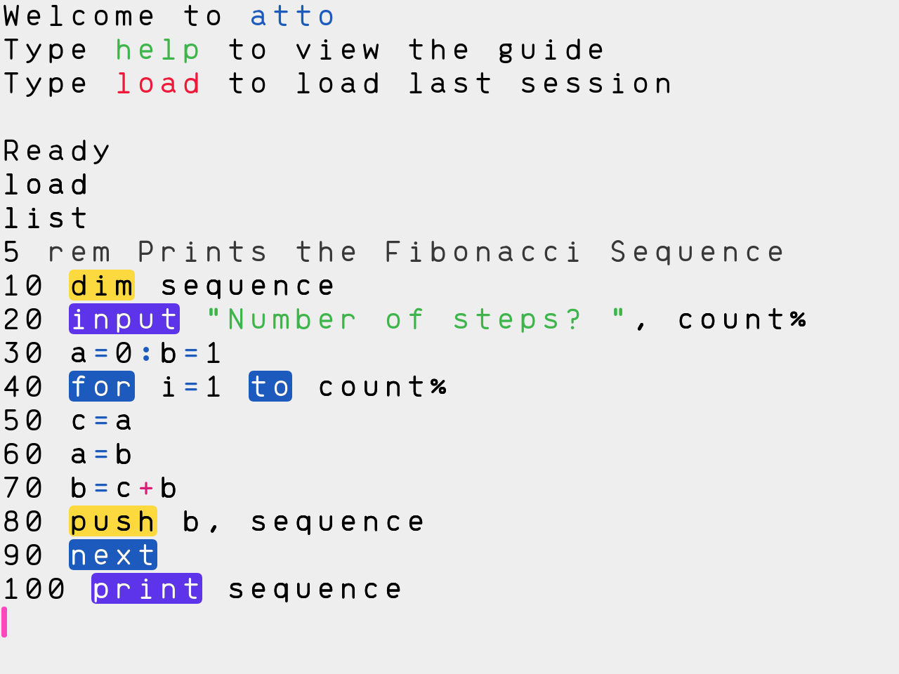

<h1 align="center"><code>atto</code></h1>

<strong>The new BASIC computer that runs in your browser!</strong>

Try it live: <a href="https://jamesl.me/atto" target="_blank">jamesl.me/atto</a>

## What is atto?
atto is a virtual fantasy computer system that's designed to teach people coding through a BASIC-like programming language.

atto is a mix of simplicity from the days of 1980s computing, paired with the modern functionality of computers today.

## Why?
Educational programming languages today don't give the user quite the same sense of ownership and accomplishment that BASIC gave when it was the predominant language of its time. Additionally, other programming languages do have their strengths and weaknesses:

* Scratch, although extremely easy for learners to use and understand, often is regarded as a misrepresentation of actual programming in that the language is not text-based. This makes it harder to jump from Scratch to other, text-based languages.
* Python is a great first language for text-based coding, considering it can be used in professional contexts too, but it doesn't seem as fun to use as Scratch and other block-based languages since it is mainly used in a text-based shell environment.

atto seeks to combine the best of both languages. BASIC has been proven to be a great programming language for learning with, since entire generations of kids became interested in the field of computer science in the 80s. Our text-based BASIC derivative hopes to use the success of the BASIC language and combine it with the modern systems of today.

## Features
atto is still in development, but hopefully, it'll have the following features:

- [x] Runs entirely in the browser, making it easy to get started with
- [x] Code authoring that's familiar to the BASIC users of the 80s, but with modern features such as text selection, copy and paste, syntax highlighting and multiline editing
- [x] Rich graphics with a 640x480 resolution, full RGBA colours and turtle drawing mode (turtle coming soon)
- [x] Accessible and inclusive to assistive technologies such as screen readers and switches (beta)
- [x] Music/melody programming, with text-to-speech support
- [x] Project link sharing to let others run the projects you make
- [ ] API support, letting your code access external services and browser features such as WebUSB to connect to game controllers
- [ ] Broadcasting to communicate between multiple instances of atto over WebRTC for making multiplayer projects
